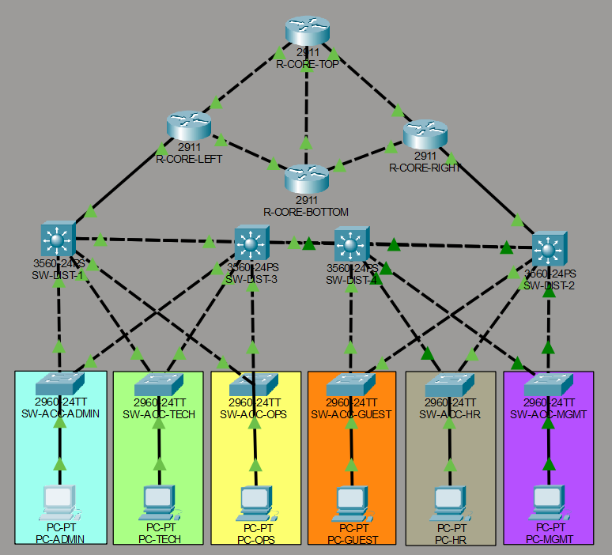
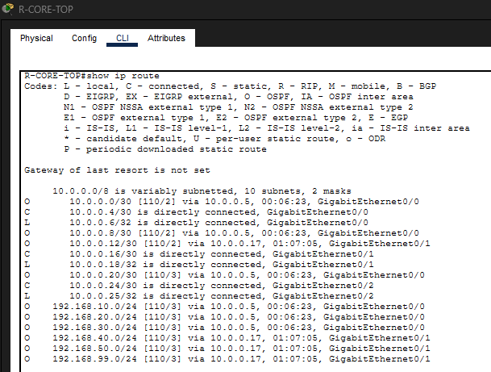
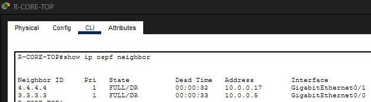
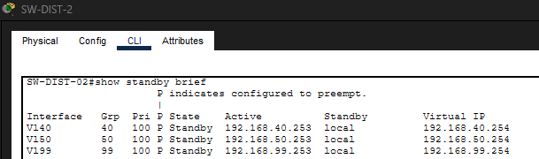
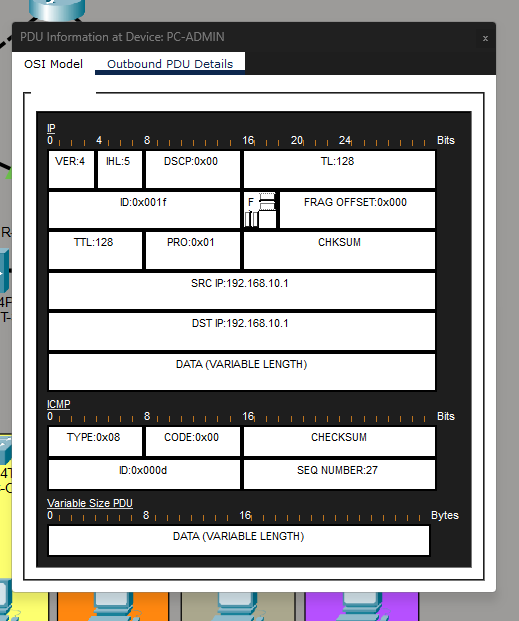
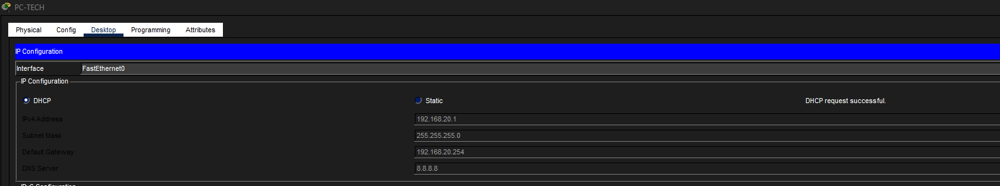

# Enterprise-Network-Infrastructure-Redundancy-Security-and-Dynamic-Routing
Enterprise Network infrastructure designed in Cisco Packet Tracer. Features a redundant topology using HSRP for high availability and OSPF for dynamic routing. Includes automated DHCP services, secure SSH management, and traffic control through ACLs. Complete with PDU analysis and configuration evidence.

# Enterprise Network Infrastructure: Core, Distribution & Access
### High Availability, Dynamic Routing, and Security Implementation

## 📌 Project Overview
This project represents a full-scale enterprise network simulation developed in **Cisco Packet Tracer**. The architecture is built on a hierarchical design (Core, Distribution, and Access) focusing on **redundancy**, **security**, and **automated management**. It features a multi-building connectivity strategy powered by an OSPF core and HSRP for seamless gateway failover.

---

## 🛠️ Technical Specifications
* **Routing:** OSPF (Open Shortest Path First) for dynamic and scalable link-state routing.
* **High Availability:** HSRP (Hot Standby Router Protocol) ensuring 24/7 gateway redundancy.
* **Management:** Secure Shell (SSH) for encrypted remote administration.
* **Security:** Standard and Extended Access Control Lists (ACLs) for granular traffic filtering.
* **Automation:** Centralized DHCP pools for dynamic IP address allocation.
* **Layer 2 Optimization:** VLAN segmentation, 802.1Q Trunking, and Port-Security.

---

## 🖼️ Visual Documentation & Evidence

### 1. Network Topology
The foundation of the project, illustrating the logical and physical connections between the buildings and the data center.

---

### 2. Core Routing & Interface Management
Verification of the **OSPF** neighbor states and the **Core Router** (TOP) interface status, ensuring all segments are reachable.

| Core Router Interface Brief | OSPF Neighbor States |
|---|---|
|  |  |

---

### 3. Redundancy Verification (HSRP)
This evidence confirms that the network remains operational even if a primary switch fails. The **Active/Standby** roles are correctly assigned between distribution layers.

    
*Figure: HSRP verification on Distribution Switches.*

### 4. Security & Access Control
Proof of **SSH** secure management and **ACL** policy enforcement. The "Security Test" below demonstrates the successful blocking of unauthorized inter-VLAN traffic.

*Figure: Ping blocked by ACL (Destination Host Unreachable).*

---

### 5. Traffic Analysis & DHCP Validation
Using the Simulation Mode to perform deep packet inspection (PDU analysis) and verifying successful DHCP address assignment.

| PDU Layer Analysis | DHCP Success |
|---|---|
|  |  |

---

## 📂 Repository Structure
* `/configs`: Cisco Packet Tracer source file (.pkt).
* `/screenshots`: Full documentation of configuration and verification steps (20 images).
* `README.md`: Detailed project documentation.

---

## 🚀 How to Run
1. Clone this repository.
2. Open the file `project_15.pkt` (or your specific file name) in **Cisco Packet Tracer v8.2** or higher.
3. Use the **Admin PC** to test SSH connectivity or run the **Simulation Mode** to observe PDU traffic flow across the OSPF core.

---

## 📜 Final Configuration Save
All devices have been committed to NVRAM to ensure persistence.

